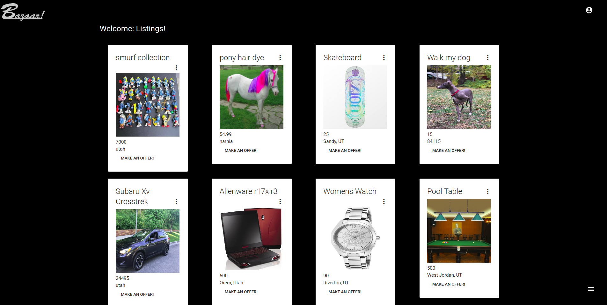
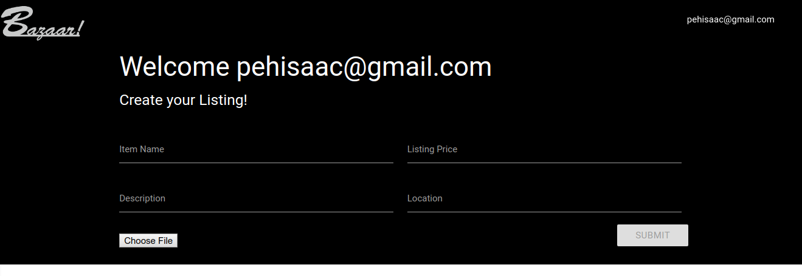
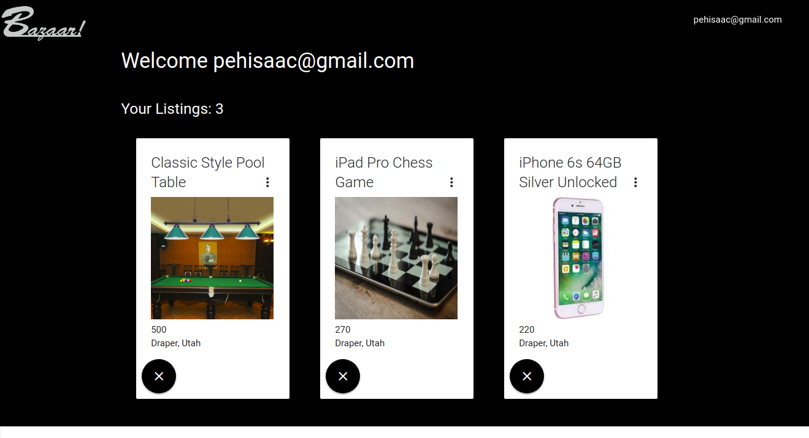
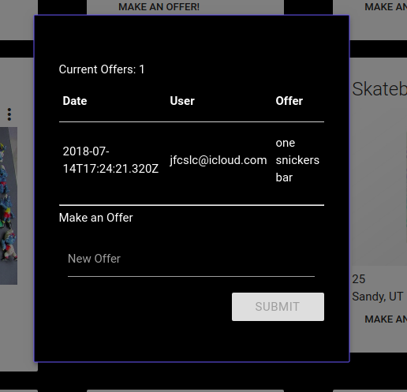

# Bazaar

<!-- place gif for main show here -->

A site for bartering and trading.

A medium to help bring people together and trade goods without the need for cash.

## Using the App

### Home Page

The home page is where you can come to browse all available listings. You can also see what offers have been made on the different items available.

You do not need a user account in order to do this. 

### Create User

In order to create a listing or to make an offer, you will need to have a user account.

You can create a user account by clicking on the user icon at the top right of the page

### Create Listing

Once you have an account and are logged in, you can create a listing. You need an image, title, price, location and a short description to create a listing.

### Update Listings

If you need to update any listings or after you have sold an item, you then navigate to your listings page and delete a listing by clicking on the large black 'X' on the bottom right of the item.

### Make offer

When you are on the main page, you can click on the "Make Offer" button and simply input your offer for the item. You must be logged in and the system will automatically include your information for the owner of the listing to contact you if they are interested.

### Respond to offer

By having access to the offerer's email address, you can simply take that email and contact the person regarding the offer they sent.

## Development Team

Isaac Pehrson | Front End Developer
https://github.com/IzzleNizzle

Kai Choi | Front End Developer
https://github.com/cetusky

Jaime Franco | Front End Developer
https://github.com/jfcslc801

Joshua Cameron | Back End Developer
https://github.com/jmcam80

Manjunath Prasad | Back End Developer
https://github.com/mpras55

## Technologies Used

* React.js

* Node.js

* Express.js

* MongoDB

* Mongoose

* Axios

* AJAX

* JSON

* Postman

* jQuery

* Heroku

* Git/Github

* Javascript

* CSS

* HTML

* Materialize
